# 🏗️ Architecture du Pipeline RAG Neurosymbolique — Évaluation ECG

> **Projet** : edu-ecg / EPCASE  
> **Branche** : `RAGontologique`  
> **Date** : 2026-02-28  
> **Auteur** : Grégoire Massoullié

---

## Table des matières

1. [Vue d'ensemble](#1--vue-densemble)
2. [Chapitre 1 — Socle ontologique (Brique 1)](#chapitre-1--socle-ontologique-brique-1)
3. [Chapitre 2 — Extraction NER (Brique 2)](#chapitre-2--extraction-ner-brique-2)
4. [Chapitre 3 — Recherche hybride (Brique 3)](#chapitre-3--recherche-hybride-brique-3)
5. [Chapitre 4 — Juge neurosymbolique (Brique 4)](#chapitre-4--juge-neurosymbolique-brique-4)
6. [Chapitre 5 — Scoring ensembliste (Brique 5)](#chapitre-5--scoring-ensembliste-brique-5)
7. [Chapitre 6 — Rapport candidat & feedback pédagogique (Brique 6)](#chapitre-6--rapport-candidat--feedback-pédagogique-brique-6)
8. [Résultats du benchmark](#résultats-du-benchmark)
9. [Stack technique](#stack-technique)

---

## 1 — Vue d'ensemble

Le pipeline transforme le **texte libre d'un étudiant** en médecine en une **note structurée avec feedback pédagogique**, en passant par 6 briques enchaînées.

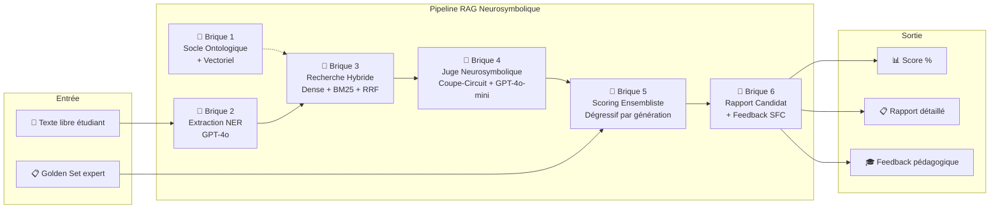

### Principe fondamental

L'étudiant écrit une interprétation ECG en texte libre. Le pipeline doit :

1. **Extraire** les concepts cliniques de ce texte (NER)
2. **Relier** chaque concept à l'ontologie ECG officielle (Recherche + Juge)
3. **Comparer** les concepts trouvés au barème expert (Scoring)
4. **Expliquer** la note avec un commentaire pédagogique ancré dans le cours (Feedback)

---

## Chapitre 1 — Socle Ontologique (Brique 1)

> **Fichier** : `ontology_index.py`  
> **Exécution** : one-off (génération d'index)  
> **Dépendance** : `ontology_from_owl.json` (OWL → JSON)

### Rôle

Transformer l'ontologie ECG (fichier OWL) en une **base vectorielle locale** exploitable en temps réel.

### Données produites

| Fichier | Contenu | Taille |
|---------|---------|--------|
| `vecteurs_ontologie.npy` | Matrice d'embeddings N×1536 | ~2.5 Mo |
| `metadata_ontologie.json` | Registre i ↔ document i | ~500 Ko |

### Architecture de l'ontologie

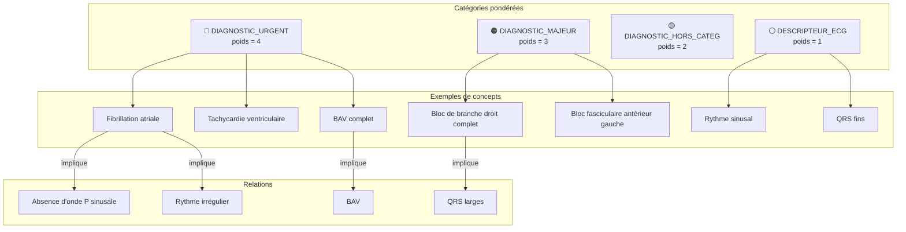

### Processus d'indexation

Pour chaque concept de l'ontologie :

1. **Normalisation** : unidecode, lowercase, suppression accents et tirets
2. **Documents générés** : nom canonique + chaque synonyme = 1 document
3. **Embedding** : OpenAI `text-embedding-3-small` (1536 dimensions)
4. **Index BM25** : tokenisation + BM25Okapi pour recherche lexicale

> **Résultat** : 411 documents indexés pour ~180 concepts, prêts pour recherche hybride.

---

## Chapitre 2 — Extraction NER (Brique 2)

> **Fichier** : `ner_extractor.py`  
> **Modèle** : GPT-4o (`gpt-4o-2024-08-06`) + Structured Outputs  
> **Latence** : ~1-2s par requête

### Rôle

Extraire du texte libre de l'étudiant une **liste structurée de concepts médicaux bruts**, sans aucune normalisation ni correction.

```mermaid
flowchart LR
    subgraph Entrée
        T["📝 «fibrillation atriale<br/>qrs fins tachycardie»"]
    end

    subgraph "Brique 2 — NER (GPT-4o)"
        direction TB
        P["System Prompt<br/>Périmètre ECG strict"]
        SO["Structured Outputs<br/>Pydantic Schema"]
    end

    subgraph Sortie
        E1["✓ present<br/>«fibrillation atriale»"]
        E2["✓ present<br/>«qrs fins»"]
        E3["✓ present<br/>«tachycardie»"]
    end

    T --> P
    P --> SO
    SO --> E1
    SO --> E2
    SO --> E3

    style P fill:#1e3a5f
    style SO fill:#1e3a5f
```

### Schéma de sortie (Pydantic)

```python
class ClinicalEntity:
    terme_brut: str       # Texte exact (pas de correction !)
    statut: "present" | "absent" | "hypothese"
    contexte_phrase: str   # Phrase d'origine
```

### Règles clés du prompt

| Règle | Description |
|-------|-------------|
| **Extraction pure** | ZÉRO normalisation. "tachi supra" → "tachi supra" |
| **Périmètre ECG** | Morphologie, rythme, diagnostics, étiologies ECG. Pas de clinique anamnestique |
| **Statut clinique** | `present` / `absent` ("pas de BBD") / `hypothese` ("suspi infarctus") |
| **Méthode LEGO** | Séparer diagnostic principal des modificateurs : "ESV polymorphe" → "ESV" + "polymorphe" |
| **Traduction numérique** | FC 150 → "Tachycardie", QRS 140ms → "QRS large", PR 240ms → "PR allongé" |

---

## Chapitre 3 — Recherche Hybride (Brique 3)

> **Fichier** : `hybrid_search.py`  
> **Moteurs** : Dense (OpenAI embeddings) + Sparse (BM25) + RRF  
> **Latence** : ~50ms par requête (dominé par l'API embedding)

### Rôle

Pour chaque terme brut extrait (Brique 2), trouver les **Top-K meilleurs concepts candidats** dans l'ontologie.

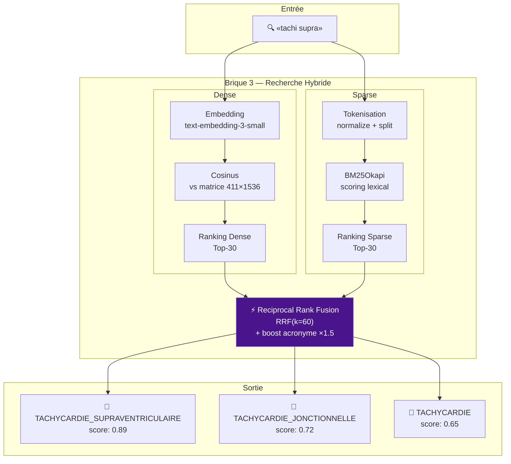

### Fusion RRF (Reciprocal Rank Fusion)

```
Score_RRF(doc) = Σ  1 / (k + rank_i(doc))
                 i∈{dense, sparse}

avec k = 60 (constante standard)
```

- **Boost BM25** : ×1.5 pour les matchs exacts (acronymes courts : "FA", "BBD", "TV")
- **Top-K final** : 5 candidats renvoyés au Juge (Brique 4)

Chaque candidat porte un flag **`is_exact_match`** si le terme normalisé de l'étudiant correspond exactement à une `surface_form` de l'ontologie.

---

## Chapitre 4 — Juge Neurosymbolique (Brique 4)

> **Fichier** : `neurosymbolic_judge.py`  
> **Modèles** : Coupe-circuit (symbolique) + GPT-4o-mini (LLM fallback)  
> **Latence** : 0ms (coupe-circuit) ou ~500ms (juge LLM)

### Rôle

Décider l'**ontology_id final** pour chaque terme brut, à partir des Top-K candidats. Peut répondre `NONE` si aucun candidat ne correspond.

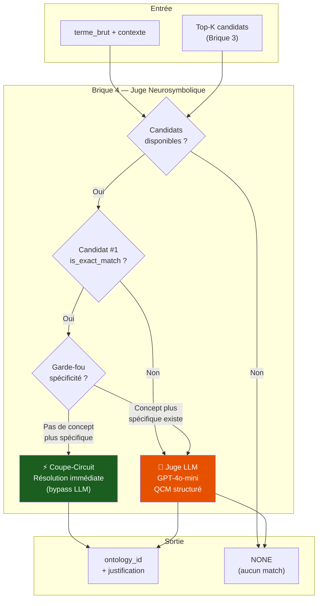

### Pipeline en détail

| Étape | Méthode | Quand ? | Exemple |
|-------|---------|---------|---------|
| **1. No candidates** | Symbolique | Aucun candidat retourné | Terme hors périmètre → NONE |
| **2. Coupe-circuit** | Symbolique | `is_exact_match = True` ET pas de concept plus spécifique | "fibrillation atriale" → FIBRILLATION_ATRIALE |
| **3. Garde-fou** | Symbolique | Le candidat exact est un descripteur (poids=1) mais un diagnostic (poids>1) plus spécifique existe | "Tachycardie" exact → TACHYCARDIE (p=1), mais TV (p=4) en #2 → passe au Juge |
| **4. Juge LLM** | GPT-4o-mini | Tous les autres cas | QCM : "Quel concept correspond à 'tachi supra' ?" → choix structuré |

### Fallback sous-terme

Si le Juge LLM renvoie `NONE`, un **fallback par sous-terme** tente de découper le terme brut en mots et de relancer la recherche sur chaque mot individuellement.

---

## Chapitre 5 — Scoring Ensembliste (Brique 5)

> **Fichier** : `scoring.py`  
> **Modèle** : Purement symbolique (aucun appel LLM)  
> **Latence** : <1ms

### Rôle

Comparer les `ontology_id` trouvés par le pipeline (Briques 2-4) au **Golden Set expert** (barème du professeur) et calculer un **score pondéré**.

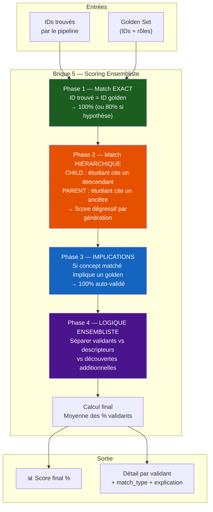

### Barème dégressif par génération

L'étudiant reçoit un **score partiel** si son concept est proche mais pas exact dans l'arbre ontologique :

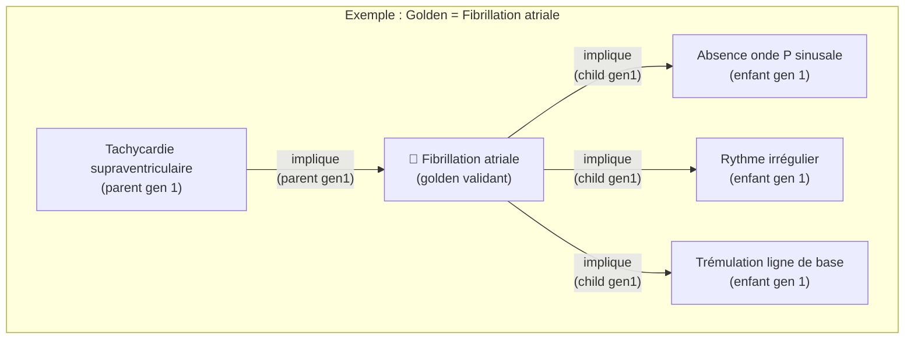

| Distance | Type | Score | Exemple |
|----------|------|-------|---------|
| 0 | **EXACT** | **100%** | "fibrillation atriale" pour golden FA |
| Gen 1 | CHILD ou PARENT | **90%** | "trémulation" pour golden FA |
| Gen 2 | CHILD ou PARENT | **80%** | Sous-signe d'un signe |
| Gen 3 | CHILD ou PARENT | **70%** | Très indirect |
| Gen 4+ | CHILD ou PARENT | **60%** | Plancher |

### Modificateurs

| Statut | Multiplicateur |
|--------|---------------|
| `present` | ×1.0 |
| `hypothese` | ×0.8 |
| `absent` | ×0.0 (ignoré) |

### Logique ensembliste

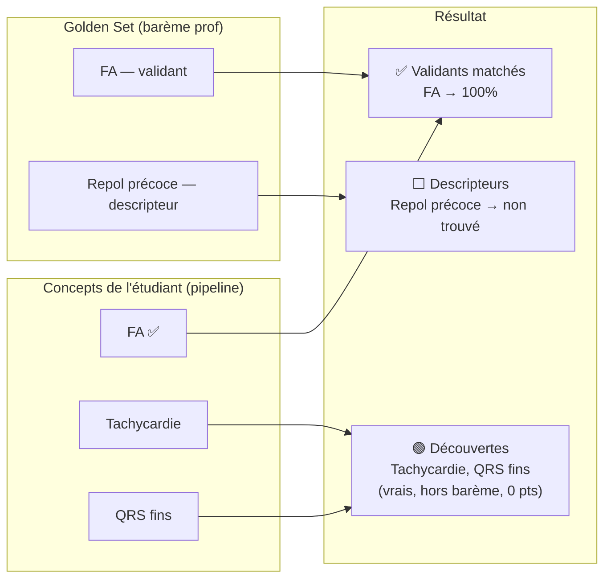

> **Score final = Moyenne des % des VALIDANTS uniquement.**  
> Les descripteurs sont informatifs. Les découvertes montrent la qualité de la lecture mais ne rapportent ni ne retirent de points.

---

## Chapitre 6 — Rapport Candidat & Feedback Pédagogique (Brique 6)

> **Fichiers** : `candidate_report.py` + `pedagogical_feedback.py` + `edn_knowledge_base.py`  
> **Modèle feedback** : GPT-4o-mini  
> **Latence** : ~2-3s (avec feedback) ou ~0s (sans)

### Rôle

Orchestrer les Briques 2→5, puis générer un **rapport structuré** pour le candidat avec un **commentaire pédagogique personnalisé** basé sur le cours SFC (Item 231 EDN).

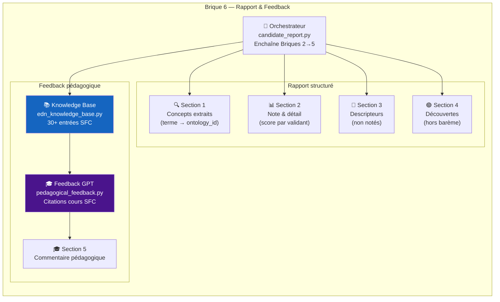

### Knowledge Base SFC (Item 231)

La base `edn_knowledge_base.py` contient **30+ entrées** extraites du cours officiel SFC (Chapitre 15 — Item 231, Référentiel CNEC 2e édition) :

| Champ | Description |
|-------|-------------|
| `ontology_ids` | IDs ontologiques liés (pour mapping automatique) |
| `rang_edn` | "A" (indispensable), "B" (important), "C" (complémentaire) |
| `titre_cours` | Titre du chapitre SFC |
| `points_cles` | Liste des points-clés à retenir |
| `pieges_classiques` | Liste des confusions fréquentes |
| `extrait_cours` | Citation directe du cours |

### Génération du feedback

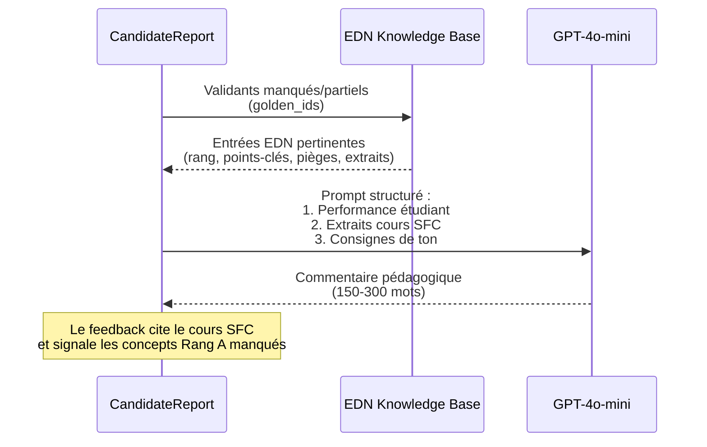

### Sorties disponibles

| Format | Usage | Fonction |
|--------|-------|----------|
| **Texte** (terminal) | Debug, CLI | `format_report_text(report)` |
| **HTML** (dark theme) | Streamlit, Notebook | `format_report_html(report)` |
| **Dataclass** | Programmatique | `CandidateReport` (13 champs) |

---

## Résultats du Benchmark

Sur le **Golden Set de 15 cas** avec 10 textes étudiants variés :

| Métrique | Valeur |
|----------|--------|
| **Score moyen** | **90.6%** |
| **Cas parfaits (100%)** | 8/15 |
| **Cas les plus durs** | BAV 2 Mobitz 2 (confusion Mobitz 1/2) |
| **Méthodes de résolution** | ~60% coupe-circuit, ~30% juge LLM, ~10% fallback |
| **Latence moyenne** | ~3-5s par cas (avec NER + recherche + juge) |

### Répartition des méthodes de résolution

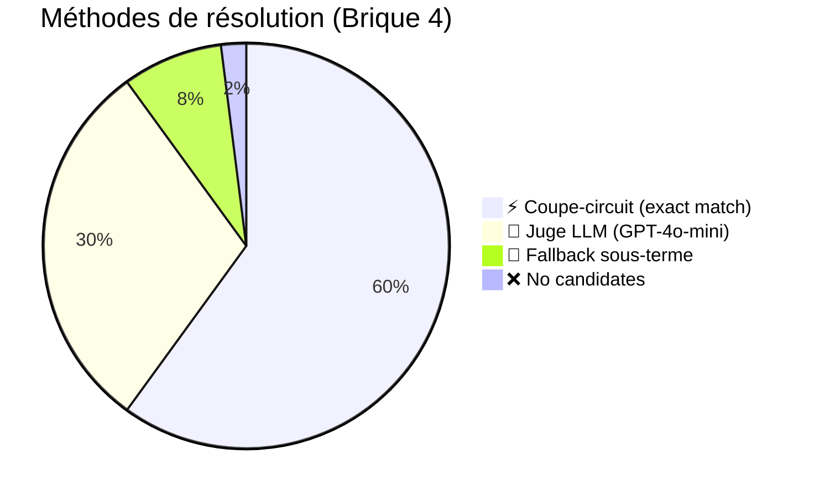

---

## Stack Technique

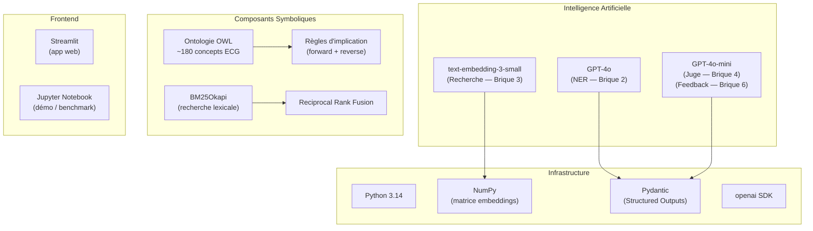

### Fichiers du pipeline

| Fichier | Brique | Lignes | Rôle |
|---------|--------|--------|------|
| `ontology_index.py` | 1 | ~616 | Indexation ontologie → vecteurs |
| `ner_extractor.py` | 2 | ~203 | Extraction NER GPT-4o |
| `hybrid_search.py` | 3 | ~399 | Recherche Dense + BM25 + RRF |
| `neurosymbolic_judge.py` | 4 | ~424 | Coupe-circuit + Juge LLM |
| `scoring.py` | 5 | ~529 | Scoring hiérarchique dégressif |
| `candidate_report.py` | 6 | ~720 | Orchestration + rapport |
| `pedagogical_feedback.py` | 6 | ~290 | Feedback GPT + cours SFC |
| `edn_knowledge_base.py` | 6 | ~660 | Base de connaissances Item 231 |

---

## Flux de données complet — Exemple

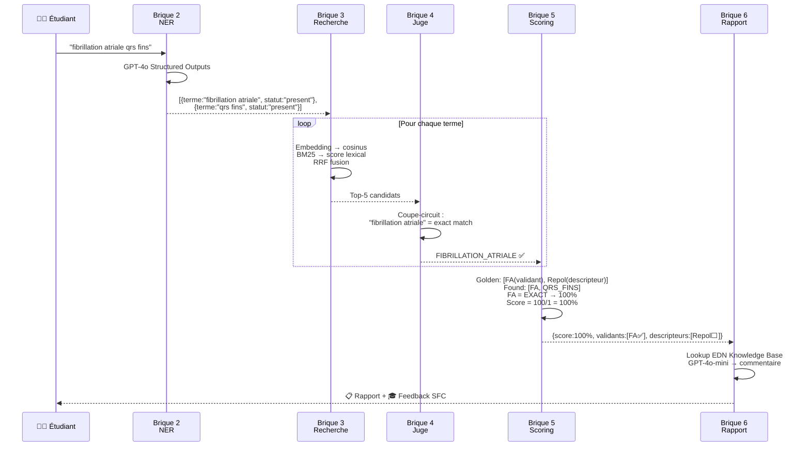

---

> *Ce document est auto-généré et reflète l'état du pipeline au 2026-02-28. Oui... enfin j'ai relu hein...*  
> *Diagrammes au format Mermaid — rendus par GitHub, VS Code, ou tout viewer Markdown compatible.*
